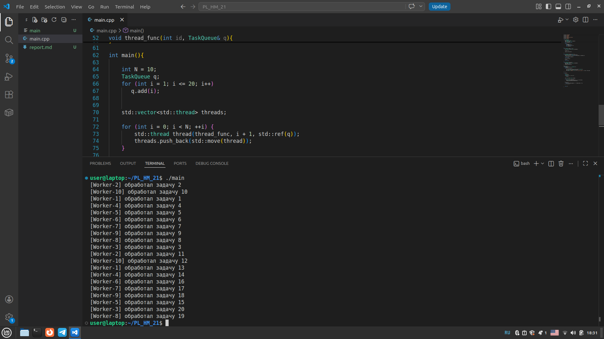

## Отчёт
### 1. Титульная информация

ФИО: Кликич Екатерина Сергеевна

Группа: СКБ252

Дисциплина: Языки программирования

Тема работы: многопоточность в C++

### 2. Постановка задачи
Задача: Реализовать консольное приложение на C++, моделирующее обработку задач несколькими потоками

### 3. Описание реализации
#### Архитектура программы

**Класс TaskQueue**

Реализован класс TaskQueue, хранящий очередь целых чисел

**Поля класса:**
- std::queue<int> q; - очередь задач
- std::condition\_variable cond\_var; - condition_variable
- std::mutex mutex; - mutex
- bool full_stop = false; - флаг завершения работы всех потоков

**Методы класса:**
- `add(int task)` - добавляет задачу в очередь
- `extract(int& task)`- извлекает задачу из очереди, если задач нет, то поток засыпает через conditional_variable
- `stop_all` - завершает работу всех потоков

**Функция void thread_func(int id, TaskQueue& q)**
- Принимает id задачи и ссылку на очередь
- имитирует работу потоков: получает задачу из очереди, обрабатывает её 1 секунду, выводит лог
- используется отдельный mutex для вывода логов

**Функция main**

Содержит главный поток, который:
- добавляет в очередь задачи 1-20
- создаёт N потоков
- завершает все потоки
- присоединяет все потоки

#### Как реализована потокобезопасная очередь
Класс TaskQueue хранит поле mutex, необходимое для синхронизации потоков и защиты данных очереди, и поле cond_var, необходимое для ожидания потоками появления задач
В методы класса добавлен std::unique_lock, который блокирует mutex для избежания одновременной работы нескольких потоков с задачами, а затем при выходе из функции разблокирует его.

#### Как и почему используется `condition_variable`
Condition_variable хранится как поле класса TaskQueue

В методе `add` cond\_var уведомляет следующий поток о том, что теперь можно работать с очередью задач

В методе `extract` с помощью cond_var.wait() поток ожидает условие, что очередь задач не пуста, или полной остановки выполнения всех потоков. Если очередь пуста, то потоки переходят в режим ожидания появления новой задачи

В методе `stop_all` через cond_var все ожидающие потоки просыпаются для корректного завершения работы

condition_variable используется для синхронизации потоков. Condition\_variable позволяет заблокировать/разблокировать выполнение потока пока другой поток не уведомит данный о выполнении условия, что очередь не пуста или full\_stop=true; 

#### Механизм корректного завершения потоков
В main во время вызова функция stop_all изменяет значение переменной full\_stop на true и активирует все неактивные потоки
В функции thread_func в цикле while она вызывается, и так как значение переменной full\_stop равно true, то цикл завершается и тем самым завершается выполнение рабочих потоков
Далее главный поток приостанавливает свою работу и ожидает окончания выполнения рабочих потоков через .join()

### 4. Демонстрация работы
Ссылка на Github: https://github.com/djjjrttth/hometask_21

Скриншот экрана:

### 5. Выводы
1. Реализовано консольное приложение на C++, моделирующее работу потоков
2. Получен опыт работы с std::thread, std::mutex, std::condition_variable в C++
3. Получен опыт реализации потокобезопасной очереди
4. Получен опыт реализован мезанизма корректного завершения потоков
